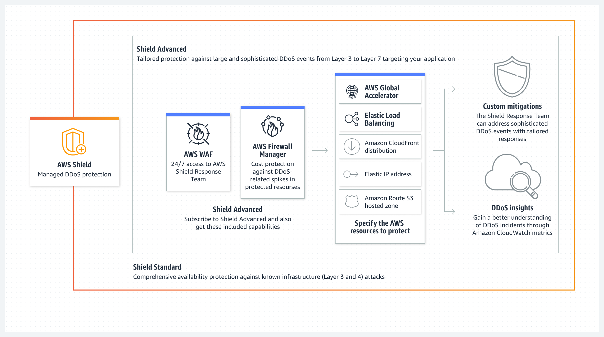

### AWS Shield 
- Free

### AWS Shield Advanced
- Option $3 per month
- Determine over Health-check
- Support 24/24

### AWS WAF

#### Features
- Web traffic filtering
	- IP addresses, HTTP headers and body, or custom URIs.
	- Multiple websites with single set of rules.
- AWS WAF Bot Control
	- Detect scrapers, scanners, and crawlers
- Account takeover fraud prevention
- Against automated login attempts by bots. 
- Full feature API
	-  Deloy and provisioned automatically with **AWS CloudFormation**
- Real-time visibility
	- Integrated with **Amazon CloudWatch** 
- Deploy on Application Load Balancer, API Gateway, CloudFront
- Integration with **AWS Firewall Manager**

#### Use cases
- Filter web traffic
- Prevent account takeover fraud
- Administer AWS WAF with APIs

### AWS GuardDuty

#### Features
- Accurate, account-level threat detection
- Continous monitoring across AWS accounts without added cost and complexity
	- AWS CloudTrail, VPC Flow Logs, and DNS Logs
- Threat detections developed and optimized for the cloud
	- Reconnaissance
	- Instance compromise
	- Account compromise
	- Bucket compromise
- Threat severity levels for efficient prioritization
- Threat response and remediation automation 
- Highly available threat detection
- One-click deployment with no addtional software or infrastruture to deploy and manage

### Amazon Inspector

#### Features
- Vulnerability management for compute workloads
- 

#### Use cases

- Quickly discover vulnerabilities in compute workloads
- Prioritize patch remediation 
- Meet compliance requirements