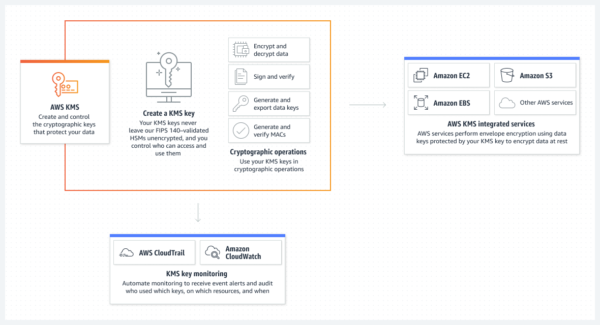

# Secure Architectures

## I. Security, Identity, and Compliance

### 1. AWS Identity and Access Management (IAM) 


#### Features

- Authentication
- Authorization
- Global service (regardless regions)
- First IAM users has no any permission.
- Can attach multiple policy for user.

#### Use cases

- Apply fine-grained permissions and scale with attribute-based access control
- Manage per-account access or scale access across AWS accounts and applications
- Establish organization-wide and preventative guardrails on AWS
- Set, verify, and right-size permissions toward least privilege

#### AWS root user

- First created user
- Highest permission
- Root account credentials

#### Components

- **User**

  - who can access AWS resources by using **username-password** or (**access key** and **secret key**)
  - be created by root user

- **Access key**
  - string is **20** characters long.
- **Secret key**
  - string is **40** characters long.

=> Access key and Secret key were used to initial API, SDK and authenticate CLI.

- **Password policy**
  - Definition of rules to validate password such as length, complexity, e.g . period
- **Multi-Factor Authentication (MFA)**
  - Secure account
  - **6** characters
  - For Root user
- **Group**
  - 1 collection of IAM users
- **Role**
  - Manage IAM which can access AWS resources
- **Policy**
  - JSON
  - Always go with Group, Roles, User

#### Best practices while creating an AWS account root user
- Use strong pasword
- Never share password or access key with anyone.
- Shoudn't encrypt the access keys and save them on Amazon S3  
- Enable AWS multi-factor authentication on your root user

#### IAM Policy example

```
{
        "Action": [
            "s3:DeleteObject"
        ],
        "Resource": [
            "arn:aws:s3:::example-bucket/*"
        ],
        "Effect": "Allow"
 }
```


Explain:

- **Effect**: specifies whether the statment will Allow or Deny an action (Allow is the effect defined here)
- **Action**: Describes a specific action or actions that will either be allowed or denied to run based on the Effect entered. API actions are unique to each service (DeleteObject is the action defined here)
- **Resource**: Specifies the resources—for example, an S3 bucket or objects—that the policy applies to in Amazon Resource Name (ARN) format ( example-bucket/* is the resource defined here).

#### Permission boundary


#### AWS CLI

- Command line interface that help access to AWS service.

### 2. AWS Key Management Service (AWS KMS)



#### Features

- Create and manage keys to protect data.
- Maximum 4KB data for each calling.
- No compatible for big data.
- Enable and disable KMS keys and automatic rotation.
- Delete to complete the key
- Create multi-Region keys

#### KMS - Customer Master Key 　(CMK) Types

- _Symmetric_ (AES - 256 keys)
  - Single encryption ( en & de)
- _Asymmetric_ (RSA & ECC key pairs)
  - Public and Private key pairs
  - En & De or Sign/Verify
  - Private key can be download, but private key need to keep carefully.
  - Enforces deleting in a **waiting period**. The default is 30 days, but can be changed.

#### KMS Automatic Key Rotation

- Used for Customer-managed CMK
- After a period time, key will be expire, need to require renewal key
- Annual or manually renewal after 90 days, 180 days

### 3. AWS CloudHSM (Cloud Hardware Security Module)


#### Features

- Manage and acess keys on FIPS-validated hardware, protected with customer-owned, single-tenant HSM
- Suitable with SSE-C encryption

#### Use cases

- Encrypt data at rest
- Offload SSL processing for web servers
- Protect private keys for an issuing CA
- Activate TDE for Oracle databases

### 4. AWS Shield


#### Features

- Standard
  - Static threshold DDoS protection for underlying AWS services
  - Inline attack mitigation
  - Free
- Advanced
  - _Tailored_ detection based on application traffic patterns
  - Health-based detection
  - Advanced attack mitigation
  - Automatic application layer DDoS mitigation
  - Option $3 per month
  - Determine over Health-check
  - Support 24/24

### 5. AWS WAF


#### Features

- Web traffic filtering
  - IP addresses, HTTP headers and body, or custom URIs.
  - Multiple websites with single set of rules.
- AWS WAF Bot Control
  - Detect scrapers, scanners, and crawlers
- Account takeover fraud prevention
- Against automated login attempts by bots.
- Full feature API
  - Deloy and provisioned automatically with **AWS CloudFormation**
- Real-time visibility
  - Integrated with **Amazon CloudWatch**
- Deploy on **Application Load Balancer**, **API Gateway**, **CloudFront**
- Integration with **AWS Firewall Manager**

#### Use cases

- Filter web traffic
- Prevent account takeover fraud
- Administer AWS WAF with APIs

#### Examble
- Block access from two countries and allow access only from the home country of the company.
- Solutions: use AWF to allow or block requests based on the rules in a web access control list (web ACL). Geographic (Geo) Match Conditions in AWS WAF allows you to use AWS WAF to restrict application access based on the geographic location of your viewers. With geo match conditions you can choose the countries from AWS WAF should allow access.

### 6. AWS GuardDuty


#### Features
- Accurate, account-level threat detection
- Continous monitoring across AWS accounts without added cost and complexity
	- **AWS CloudTrail**, **VPC Flow Logs**, and **DNS Logs**
- Threat detections developed and optimized for the cloud
	- Reconnaissance
	- Instance compromise
	- Account compromise
	- Bucket compromise
- Threat severity levels for efficient prioritization
- Threat response and remediation automation 
- Highly available threat detection
- One-click deployment with no addtional software or infrastruture to deploy and manage

#### Use cases

- Improve security operations visibility
- Assist security analyst in investigations
- Identify files containing malware
- Route insightful information on security findings

#### Disable the service in the general settings 
- Disabling the service will delete all remaining data, including your findings and configurations before relinquishing the service permissions and resetting the service. 

#### Examble
 - Monitor any malicous activity on S3


### 7. Amazon Inspector


#### Features
- _Vulnerability_ management for compute workloads
- Simplified one-click onboarding and integration with **AWS Organizations**
- Automated discovery and continual vulnerability scanning
- AWS Systems Manager Agent
- Inspector risk score for findings
- Suppression of findings
- Automatic closure of _remediated_ findings
- Detailed coverage monitoring
- Integration with Security Hub and EventBridge
- Vulnerability mapping to layers in Lamda functions

#### Use cases
- Quickly discover vulnerabilities in compute workloads
- Prioritize patch remediation
- Meet compliance requirements
- Identify zero-day vulnerabilities sooner

#### Examble

- Use security assessments provided by Amazon Inspector to check for vulnerabilities on EC2 instances

### 8. AWS CloudTrail


#### Features
- Always on 
- Storage and monitoring
- _Immutable_ and encrypted activity logs
- _Insights_ and analytics
- Multi-region
- Multi-account
- Event save maxi

#### Use cases
- Audit activity
- Identify security incidents
- Troubleshoot operational issues

#### CloudTrail Events
- Management Events
	- Excuted on resource of AWS account
	- Read Event and Write Event 
- Data Events
	- Lambda function execution
	- AWS S3 object-level activity 
- CloudTrail Insights Events
	- Detect unusual activity 

### 9. AWS CloudWatch


#### Features
- Collect
	- Easily collect and store logs
		- Vended logs
		- Logs published by AWS services
		- Custom logs 
	- Collect and _aggregate_ infrastructure and application metrics
	- Collect and aggregate container metrics and logs
	- Collect and aggregate Lamda metrics and logs
	- Stream Metrics
- Monitor
	- Cross-account observability across multiple AWS accounts
	- Unified operational view with dashboard
	- _Composite_ alarms
	- High-resolution alarms
	- Logs and metrics _correlation_ 	
	- Application Insights
	- Container monitoring insights
	- Internet Monitor
	- Lamda monitoring insights
	- _Anomaly_ Detection
	- ServiceLens
	- Synthetics
	- RUM
- Act
	- Auto Scaling
	- Automate repsonse to operational changes with CloudWatch Events
	- Alarm and automate actions on EKS, ECS, and k8s clusters
- Analyze
	- Granular data and extended retention
	- Custom operations on metric
	- Log analytics
	- Analyze container metric, logs, and traces
	- Analyze Lambda metrics, logs, and traces
	- Contributor Insights
	- Metrics Insights
	- Evidently
- Compliance and Security

#### Use cases
- Monitor application performance
- Perform root cause analysis
- Optimize resources proactively
- Test website impacts

#### Components
- CloudWatch Metric 
	- Provide metric for all AWS services
	- Metric: CPU, NetworkIn, NetworkOut...
	- Dimensions: key/value
	- **Maximum 10** dimensions / metric
	- Require link to timestamp
	- To create using PutMetricData
- CloudWatch Logs
	- Log groups
	- Log stream
	- Determine (Forever, 30 days..)
- CloudWatch Logs Metric Filter & Insights
	- Filter data
	- Simply query logs
- CloudWatch Agent
	- By default EC2 cannot send log to CloudWatch
	- **Require** run CloudWatch Agent on EC2 to push log 
- CloudWatch Alarms 
	- Trigger notification for metric
	- Options: min, max, %, sampling
	- Alarm states: OK, INSUFFICIENT_DATA, ALARM
	- Period
- EC2 Instance Recovery
	- StatusCheckFailed_System metric
	- Recovery an EC2 without changing Private/Public IP, Elastic IP, metadata...

- AWS CloudWatch Events
	- Events: the changes of AWS resources
	- Rules: define event and target
	- Target: handle event place.

### 10. Amazon Cognito


#### Features

- Identity Management
	- Self registration
	- Identity store (Amazon Cognito user pools)
	- Migration options
- User Authentication
	- Flexible Authentication
	- Federation
- Access Control
	- Last mile integration with apaplications
	- Access AWS resources
	- Machine-to-machine authentication
- Customer Experience
	- Customer outreach
	- Business agility amplified 
	- Extensibility
- Security
	- Bot detection
	- Compliance	     	 

#### Use cases

- Engage customers with flexible authentication
- Manage B2B identities
- Secure machine-to-machine authentication
- Get role-based access to AWS resources


### 11. AWS Config


#### Features

- Configuration history of AWS resources
- Configuration history of software
- Resource relationships tracking
- Configurable and customizable rules
- Conformance packs
- Multi-account, multi-Region data aggregation
- **Extensibility**
- Configuration snapshots
- Cloud governance dashboard
- Partner solutions
- Integrations
	- AWS Organizations
	- AWS CloudTrail
	- Connect with ITSM / ITOM Software
	- AWS Security Hub
	- AWS Audit Manager
	- AWS System Manager
	- AWS Firewall Manager
	- Amazon EC2 Dedicated Host
	- Application Load Balancers
	
### 12. AWS Security Hub


### Features
- Automated, continous security best practice checks
- Consolidated findings across

### Use cases
- Conduct Cloud Security Posture Management (CSPM)
- Initiate Security Orchestration Automation, and Response (SOAR) workflows
- Save time and money by simplifying integrations
- Correlate your security finding to discover new insights


### 13. AWS Route 53


#### Components

- Route 53 - Records
	- Name of domain/sub-domain
	- Record types (A, AAAA...)
	- Value (e.g. 10.2.11.3)
	- Routing policy
	- TTL
-  Record types
	- **A**: Mapping hostname to IPv4
	- **AAAA**: Mapping hostname to IPv6
	- **CNAME**: Mapping hostname to anothers
	- **NS**: Name Servers for **Hosted Zone** 
- Hosted Zone 
	- **Public hosted zones**: contain records that you want to route on the Internet
	- **Private hosted zones**: contain records you want to route traffic inside **Amazon VPC**.
- Routing Policy 
	- Simple
		- **CANNOT** use Health Checks 	
	- Weighted 
		- Load Balancing between regions
	- Latency 
	- Failover
	
	
	- Geolocation 
	- Geoproximmity 
		- Define bias
		 	- Increase bias: 1~99 : increase traffic to resource
		 	- Decrease bias: -1~-99 : decrease traffic to resource
	 	- Resouces can be AWS resources or Non-AWS resources
 		- Require **Traffic Flow**
	- Multi Value
		- Incompatible with ELB

- Health Checks
	- Can detect CloudWatch Alarms
	- Healthy/Unhealthy Threshold (Default:3)
	- Interval: 30s
	- Support: HTTP, HTTPS, TCP
	- If > **18**%: **Healthy**; else **Unhealthy**    


#### Use cases
- Manage network traffic globally
- Build highly availble applications
- Set up private DNS


### 14. AWS Cloudfront


#### Features
- Enhance performance of read data by caching at Egde location
- There are 216 Egde location on the world
- **AWS Shield**, **AWS AWF**, **Amazon Route 53**, and** AWS CloudFront** work seamlessly together to create a flexible, layered security perimeter against multiple types of attacks including network and DDoS.
- Doesn't belong to a VPC


#### Use cases
- Deliver fast, secure websites
- Accelerate dynamic content delivery and APIs
- Stream live and on-demand video
- Distribute patches and updates

#### Components
- Cloudfront Origins
	- S3 bucket:
		- Cache file at Edge location
		- Origin Access Identity (OAI)
		- Ingress for S3 uploading
	- Custom origin (HTTP)
		- Application Load Balancer
		- EC2 instance
		- S3 website
- Cloudfront - Geo restriction
	- Whitelist: list of nationality/region which can be accessed
	- Backlist: list of denied nationality/region 
- Cloudfront Signed URL/Signed Cookies
	- Signed URL: particular file (signed url/1 file)
	- Signed Cookies: multiple access files (1 signed cookies/many file)

#### Shoud skip content types
- Proxy methods PUT/POST/PATCH/OPTIONS/DELETE go directly to the origin
- Dynamic content, as determined at request time (cache-behavior configured to forward all headers)	

### 15. AWS S3

- Encryption
	- Server-side encryption: S3 side
		- SSE - S3: 
				
			- Managed by AWS
			- Object encrypted by sever-side
			- Method: AES-256
			- Set header: "x-amz-server-side-encryption":"AES256"
		
		- SSE - KMS: Use KMS manage encryption keys
				
			- Key provided by KMS
			- Object encrypted by sever-side
			- Set header: "x-amz-server-side-encryption":"aws:kms"
		- SSE - C: 
					
			- Encryption by server-side using keys which provided by client
			- Require: HTTPS
			- Provide in HTTPs header of each request.

			
	-  Client-side encryption: client side encrypt and upload data on S3
		
		- Encrypted before upload on S3
		- Use Amazon S3 Encryption Client
	
		
	-  Transit - SSL TLS
		 
- When you apply a retention period to an object version explicitly, you specify a Retain Until Date for the object version - You can place a retention period on an object version either explicitly or through a bucket default setting. When you apply a retention period to an object version explicitly, you specify a Retain Until Date for the object version. Amazon S3 stores the Retain Until Date setting in the object version's metadata and protects the object version until the retention period expires.

- Different versions of a single object can have different retention modes and periods 
	- Like all other Object Lock settings, retention periods apply to individual object versions. Different versions of a single object can have different retention modes and periods.

	For example, suppose that you have an object that is 15 days into a 30-day retention period, and you PUT an object into Amazon S3 with the same name and a 60-day retention period. In this case, your PUT succeeds, and Amazon S3 creates a new version of the object with a 60-day retention 	period. The older version maintains its original retention period and becomes deletable in 15 days.
   

## Authors

- [daiking](https://github.com/mrdaiking)

## Refs

- https://dev.to/aws-builders/encrypt-your-s3-object-1al
